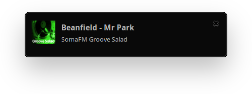

# SomaFM

> Play & record [SomaFM](https://somafm.com) radio channels


## Features



- Play all [SomaFM channels](https://somafm.com/listen/) directly in your terminal.
- Play [random channel](#-somafm-play-channel--random).
- Nice & clean output of playing song including timestamp and song history.
- Desktop notifications on track change [can be enabled](#-n).
- [Specify channel directly](#-somafm-play-channel--random) or use [interactive mode](#-somafm).
- [Show channel list and search](#-somafm-list-keywords) by name and genre.
- Hit <kbd>+</kbd> to instantly add playing song to [favourites list](#-somafm-list-favourites-keywords).
- Copy current song title to clipboard by pressing <kbd>c</kbd>.
- [Record channels](#-somafm-record-channel) and save tracks to your working directory.


## Install

With [yarn](https://yarnpkg.com):

```console
$ yarn global add somafm
```

or with [npm](https://www.npmjs.com):

```console
$ npm install --global somafm
```

Playing a channel requires [mpv](https://mpv.io) on your system. Please make sure you have it installed and the `mpv` command can be run within your shell.

To record a channel, you need [Streamripper](http://streamripper.sourceforge.net) and its executable `streamripper`.

On Linux, the `xclip` package is needed to enable copying the current song title to the clipboard.


## Usage

### Commands

#### `$ somafm`

Interactive mode. Choose a channel to play from the list.

#### `$ somafm list [<keywords>]`

Show a list of all SomaFM channels. You can filter by one or more keywords.

#### `$ somafm play <channel> | random`

Play a channel. To specify a channel, use the ID from the channel list (lower-case, no spaces), e.g. `beatblender`. Use `random` to play any channel.

#### `$ somafm info <channel>`

Get channel information.

#### `$ somafm record <channel>`

Record a channel. Tracks are saved into a directory containing channel name, date and time, e.g. `SomaFM Groove Salad/20171011_213324`. It is automatically created in the current working directory.

#### `$ somafm list-favourites [<keywords>]`

List your favourite songs. You can filter by one or more keywords in song title and channel name.

#### `$ somafm edit-favourites`

Edit your favourites songs file.

### Command aliases

All commands have short aliases for faster typing.

Command           | Alias
----------------- | -----
`list`            | `ls`
`play`            | `p`
`info`            | `i`
`record`          | `r`
`list-favourites` | `lf`
`edit-favourites` | `ef`

### Options

#### `-n`

Show desktop notifications.

### Keyboard shortcuts

While playing, the following keyboard shortcuts are available:

Description                          | Key
------------------------------------ | ------------------------------
Copy current song title to clipboard | <kbd>c</kbd>
Add current song to favourites       | <kbd>+</kbd> or <kbd>f</kbd>
Remove current song from favourites  | <kbd>-</kbd> or <kbd>u</kbd>
Enable desktop notifications         | <kbd>n</kbd>
Disable/mute desktop notifications   | <kbd>m</kbd>
Stop playback & quit application     | <kbd>q</kbd> or <kbd>esc</kbd>
