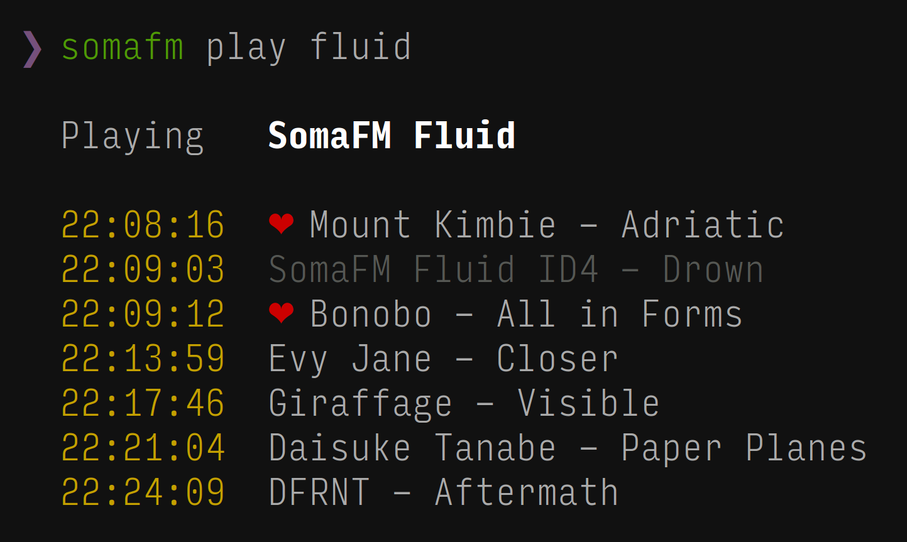

# SomaFM

> Play & record [SomaFM](https://somafm.com) radio channels




## Install

```
$ npm install --global somafm
```


## Usage

### `$ somafm list [<filter>]`

List [SomaFM channels](https://somafm.com/listen/). You can filter by one or more keywords.

### `$ somafm play <channel>`

Play a channel. Requires [MPlayer](https://mplayerhq.hu). Please make sure you have it installed and the `mplayer` command can be run within your shell.

#### Keyboard shortcuts

Description                          | Key
------------------------------------ | ------------------------------
Copy current song title to clipboard | <kbd>c</kbd>
Add current song to favourites       | <kbd>f</kbd> or <kbd>+</kbd>
Remove current song from favourites  | <kbd>u</kbd> or <kbd>-</kbd>
Increase volume                      | <kbd>*</kbd> or <kbd>0</kbd>
Decrease volume                      | <kbd>/</kbd> or <kbd>9</kbd>
Mute/unmute                          | <kbd>m</kbd>
Stop playback & quit application     | <kbd>q</kbd> or <kbd>esc</kbd>

### `$ somafm info <channel>`

Get channel information.

### `$ somafm record <channel>`

Record a channel. Requires [Streamripper](http://streamripper.sourceforge.net).

### `$ somafm list-favourites`

List your favourite songs.

### `$ somafm edit-favourites`

Edit your favourites songs file.


## Command aliases

All commands have short aliases for faster typing.

Command           | Alias
----------------- | -----
`list`            | `l`
`play`            | `p`
`info`            | `i`
`record`          | `r`
`list-favourites` | `lf`
`edit-favourites` | `ef`


## License

MIT © [Christoph Uschkrat](https://c.uschkrat.com)
